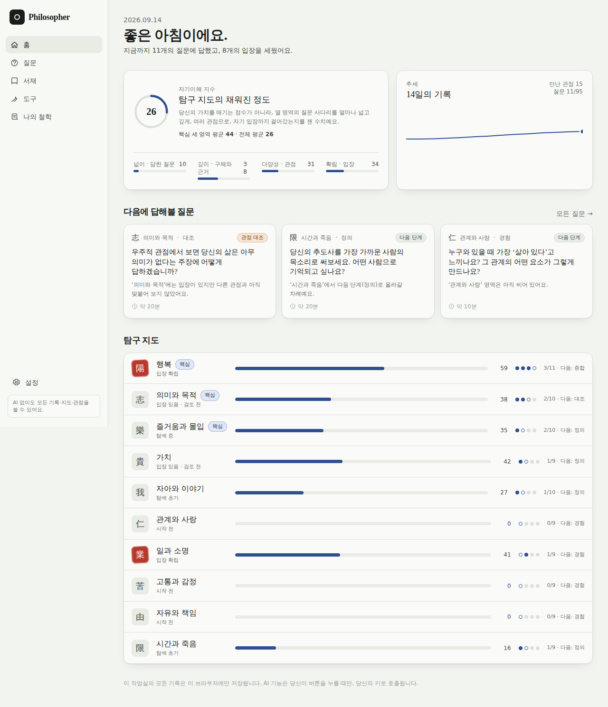
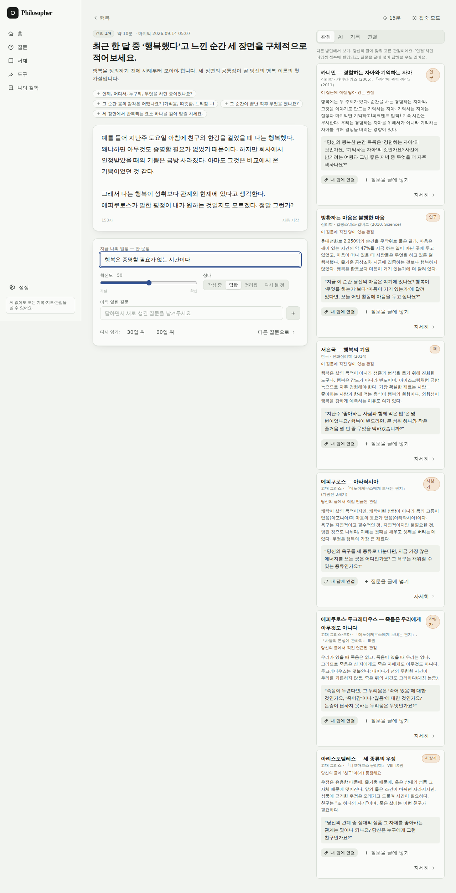

# Philosopher — 나를 이해하고, 나의 철학을 세우는 작업실

> 행복은 무엇인가. 삶의 목적은 무엇인가. 나는 무엇을 할 때 즐거운가.
> 한 번에 답할 수 없는 질문을, 경험 → 정의 → 대조 → 종합의 사다리로 반복해서 오르는 곳입니다.

브라우저에서 동작하는 정적 웹앱입니다. 서버가 없고, 모든 기록은 당신의 브라우저(IndexedDB)에만 저장되며, AI는 **당신의 키로, 당신이 버튼을 누를 때만** 호출됩니다. AI 없이도 질문·관점·지도·도구·문서가 전부 동작합니다.



## 무엇을 하는가

| 기능 | 설명 | 비용 |
| --- | --- | --- |
| **질문 사다리** | 10개 영역(행복, 의미와 목적, 즐거움과 몰입, 가치, 자아와 이야기, 관계와 사랑, 일과 소명, 고통과 감정, 자유와 책임, 시간과 죽음) × 4단계(경험·정의·대조·종합) = 95개 질문. 각 질문에 글쓰기 단서, 함정 경고, 선행 질문이 붙어 있습니다. | 0 |
| **관점(서재)** | 112개의 관점 — 아리스토텔레스부터 장자·원효·퇴계, 프랭클·카뮈·울프·누스바움, 그리고 카너먼·SDT·쾌락 적응·의미의 세 겹 같은 심리학 연구까지. 각 관점은 입장 요약, 핵심 개념, **당신에게 되묻는 질문**, 출처(원전·논문·국역본)를 갖습니다. 글을 쓰면 관련 관점과 *맞서는* 관점이 자동으로 옆에 놓입니다. | 0 |
| **자기이해 지수** | 영역마다 넓이(답한 질문)·깊이(구체성·근거·구조)·다양성(만난 관점·반론)·확립(한 문장 입장과 확신도)을 계산하고, 마샤의 정체성 지위 모델(탐색 × 전념)로 “탐색 초기 / 입장 있음·검토 전 / 탐색 중 / 입장 확립”을 붙입니다. 점수는 사람의 가치가 아니라 **지도의 채워진 정도**입니다. | 0 |
| **다음 질문 추천** | 사다리(선행 질문), 약한 영역, 최근 흐름, 그리고 격차 규칙(입장은 있는데 다른 관점을 안 봤으면 대조 질문, 관점은 많이 봤는데 입장이 없으면 종합 질문)을 조합해 이유와 함께 제시합니다. 30일 넘은 입장은 “지금도 동의하나요?”로 다시 불러옵니다. | 0 |
| **도구** | 가치 카드 정렬(슈워츠 가치 구조), 즐거움 기록(경험표집 + 좋은 시간 일지: 몰입·에너지·플로우), 자기 점검(삶의 의미 존재/탐색, 삶의 만족, 자기개념 명료성, 반추/성찰) — 결과는 질문 답변으로 가져올 수 있습니다. | 0 |
| **나의 철학** | 질문마다 세운 입장을 하나의 살아 있는 문서로 모읍니다. 마크다운 편집·읽기, 이전 판 보관, .md 내보내기. | 0 |
| **AI 성찰** (선택) | 글을 읽고 요약·잘 된 점·숨은 전제·다음 질문(명료화/전제/근거/관점/함의)·**다른 답과의 긴장**·지금 도움이 될 관점(서재 안에서만 고름)·루브릭을 JSON 한 번의 호출로 돌려줍니다. 같은 글에는 다시 호출하지 않습니다. | 호출당 보통 수 원 |
| **소크라테스식 대화** (선택) | 한 번에 질문 하나, 3문장 이내, 강의 금지. “정리해줘”로 입장 초안을 받습니다. | 턴당 수 원 이하 |
| **AI 철학 초안** (선택) | 입장·가치·발췌를 재료로 ‘나의 철학’ 초안을 씁니다. 당신이 쓰지 않은 주장은 보태지 않도록 지시합니다. | 호출당 수십 원 이하 |



## 시작하기

```bash
npm install
npm run dev        # http://localhost:5173
```

```bash
npm run build      # 정적 파일 → dist/
npm run preview    # 빌드 결과 미리보기
npm test           # 콘텐츠 무결성 + 엔진 테스트
npm run lint
```

빌드 결과는 `base: './'` + 해시 라우팅이라 어떤 정적 호스팅(GitHub Pages 하위 경로, Netlify, Cloudflare Pages, 로컬 폴더)에서도 그대로 동작합니다.

### GitHub Pages로 배포

배포 워크플로(`.github/workflows/deploy-pages.yml`)는 `main` 푸시마다 빌드해 배포합니다. 다만 **Pages 자체를 켜는 일은 저장소 소유자만 할 수 있습니다** — Actions 토큰으로는 Pages 사이트를 만들 수 없고(`Resource not accessible by integration`), `gh-pages` 브랜치를 올려도 자동으로 켜지지 않습니다.

한 번만 해주세요: 저장소 **Settings → Pages → Build and deployment → Source**를 **GitHub Actions**로 선택합니다. 그 다음 Actions 탭에서 **Deploy to GitHub Pages**를 실행하거나 `main`에 푸시하면 `https://<계정>.github.io/philosopher/`에 배포됩니다. 비공개 저장소는 GitHub Pro 이상에서만 Pages를 쓸 수 있으니, 무료 플랜이면 저장소를 공개로 바꾸는 방법도 있습니다(키는 저장소에 없습니다).

대안으로 `gh-pages` 브랜치에 최신 빌드가 올라가 있으니, Source를 **Deploy from a branch → gh-pages**로 골라도 바로 서비스됩니다.

## AI 연결

설정 → AI 연결. 세 가지 방식이 있습니다.

| 제공자 | 방법 | 비고 |
| --- | --- | --- |
| **OpenRouter** | **“OpenRouter로 로그인”** — 공식 OAuth PKCE 흐름으로 이 앱 전용 키가 자동 발급됩니다(기본 크레딧 한도 $5). 또는 openrouter.ai/keys에서 만든 키를 붙여넣기. | 한 키로 수백 모델. `:free` 모델은 0원. 실제 비용이 응답에 포함되어 정확히 집계됩니다. |
| **OpenAI** | platform.openai.com/api-keys에서 만든 API 키. | 비용은 가격표 기반 추정. |
| **직접 지정** | OpenAI 호환 엔드포인트의 Base URL(+선택적 키). | Ollama·LM Studio 같은 로컬 모델이면 0원. Ollama는 `OLLAMA_ORIGINS=*`로 실행해야 브라우저에서 접근됩니다. 직접 운영하는 프록시도 연결할 수 있습니다. |

키는 이 브라우저의 저장소에만 남고, 내보내기 파일에는 포함되지 않습니다.

**배포본에 키를 미리 넣어두고 싶다면** 빌드에 키를 넣지 마세요(정적 사이트는 누구나 번들을 읽을 수 있습니다). 대신 한 번만 쓰는 **설정 링크**를 쓰면 됩니다: `https://<배포 주소>/#/settings?or_key=<OpenRouter 키>&model=<모델 id>` (OpenAI 키는 `oa_key`). 앱이 열리면서 키와 모델을 브라우저 저장소에 넣고, 주소에서 즉시 지웁니다.

**실제 모델로 검증하기**: Actions 탭의 **LLM live check** 워크플로를 모델 id와 키를 입력해 실행하면, 러너에서 `src/llm/live.test.ts`가 성찰·대화·철학 초안 호출을 실제로 수행하고 사용량과 비용을 로그에 남깁니다. 키는 로그에서 마스킹되며 저장소에 기록되지 않습니다. 끝나면 실행 기록을 지워도 됩니다.

**“ChatGPT로 로그인(Sign in with ChatGPT)”에 대해.** 2026년 9월 현재 OpenAI는 이 OAuth를 Codex 도구 안에서만 제공하고, 서드파티 앱의 사용 허용 여부는 공식적으로 답하지 않고 있습니다. 그래서 이 앱은 OpenAI를 API 키로만 지원합니다. 제공자 계층(`src/llm/`)은 OpenRouter와 같은 PKCE 흐름을 이미 갖고 있어, OpenAI가 공개 OAuth를 열면 설정 몇 줄로 추가할 수 있습니다. 그 전까지 ChatGPT 구독을 쓰고 싶다면, 본인이 직접 운영하는 OpenAI 호환 프록시를 “직접 지정”으로 연결하는 방법이 있습니다(약관 준수는 본인 책임입니다).

### 비용을 낮게 유지하는 설계

- 관점 추천, 점수, 다음 질문, 도구, 문서 — 전부 로컬 계산. 네트워크 호출 없음.
- AI는 명시적 버튼에서만, 짧은 프롬프트로 한 번. 응답 길이 상한(`max_tokens`)이 걸려 있습니다.
- 성찰 결과는 글의 해시와 함께 저장되어, 글이 바뀌기 전에는 다시 호출하지 않습니다.
- 대화는 최근 10턴만 보냅니다.
- 관점 제시는 서재의 후보 목록(id)으로 제한해, 모델이 존재하지 않는 문헌을 지어내지 못하게 합니다.
- 월 예산과 “예산 초과 시 차단”을 설정할 수 있고, 버튼마다 예상 비용을 표시합니다.
- 기본 모델은 저렴한 순으로 고릅니다(`src/llm/models.ts`의 `PREFERRED_MODELS`).

## 점수는 어떻게 계산되나

`src/engine/scoring.ts`에 전부 있습니다. 요약하면:

- **답변 신호**(`signals.ts`): 글자 수, 문단, 구체적 장면(“예를 들어”, 시간·장소 표현), 이유(“때문에”), 대조(“하지만”, “반면”), 불확실성(“모르겠다”), 자기 질문(?), 입장 표현, 사상가 이름 언급. 한국어 규칙 기반이라 즉시·무료입니다.
- **답변 점수**: 깊이 = 길이 + 장면 + 이유 + 대조 + 메타인지 + 구조. AI 루브릭이 있으면(그리고 글이 그대로면) 절반씩 섞습니다. 다양성 = 연결/언급한 관점 + 대조 + 열린 질문. 확립 = 입장 존재 × 확신도.
- **영역 점수** = 30% 넓이 + 25% 깊이 + 20% 다양성 + 20% 확립 + 5% 되돌아봄. 상태는 다양성·확립 ≥ 0.5 여부의 2×2로 정합니다(마샤, 1966).
- **자기이해 지수** = 10개 영역 평균. 홈에서는 핵심 3영역 평균도 함께 보여줍니다.

## 콘텐츠를 늘리려면

- 질문: `src/content/questions.ts` — `id, domainId, level(1–4), kind, title, why, cues, caution?, lensIds, prereqIds?, tags, minutes`.
- 관점: `src/content/lenses-*.ts` — `id, type, name, origin, position, keyConcept, challenge, sources, tags, contrastsWith?`. 질문 쪽 `lensIds`에 넣으면 자동으로 연결됩니다.
- `npm test`가 참조 무결성(존재하지 않는 관점·선행 질문, 쓰이지 않는 관점, 단계 누락)을 검사합니다.

## 구조

```
src/
  content/   도메인·질문·관점·가치 카드·점검 척도 (정적 데이터)
  engine/    신호 분석, 점수, 추천, 관점 검색 (로컬)
  llm/       PKCE, 채팅 클라이언트(스트리밍), 모델 목록, 비용, 프롬프트, 기능
  store/     zustand + IndexedDB 영속화, 내보내기/가져오기
  pages/     홈, 질문, 영역, 질문 작업실, 서재, 관점, 도구, 나의 철학, 설정, 온보딩
  tools/     가치 정렬, 즐거움 기록, 자기 점검
  ui/        레이아웃, 프리미티브, 차트, 패널
```

Vite 8 · React 19 · TypeScript · Tailwind 4 · Zustand · react-router(해시) · Vitest.

## 안내

이 작업실은 치료나 상담을 대신하지 않습니다. 글에 위기 신호가 감지되면 조용히 연락처를 보여줍니다: 자살예방상담전화 **109**, 정신건강위기상담 **1577-0199**, 청소년 **1388**. 질문은 반추(“왜 나는”)보다 통찰(“무엇이 있었나”)로 향하도록 설계되었고, 집중 타이머와 3인칭 서술 같은 연구 기반 장치를 넣었습니다.

서재의 관점은 원전과 논문을 요약한 것입니다. 정확성을 위해 애썼지만 요약은 요약이므로, 중요한 인용은 출처에서 확인하세요.
